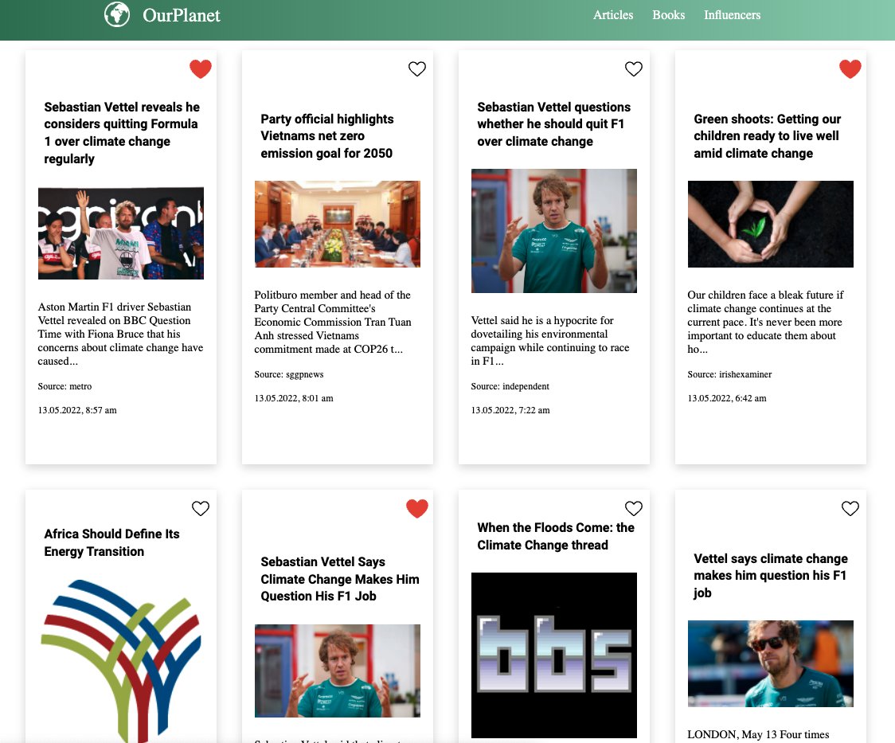

# OurPlanet

## A climate change portal for a better world

## About the project

As the climate change affects our lives more and more, we have developed a portal in order to promote awareness on environmental protection.
"OurPlanet" is a React-based web application, allowing you to have the latest news related to climate change in one place. But that's not all! We also provide the user with a list of the best books and environmental activists/influencer on social media to encourage the user to care more about our beautiful planet.

## Features

-latest news about climate change
-list of the best books regarding environment and climate change
-section about environmental influencer on social media

## Demo

Live demo on Netlify:

## Installation

If you want to run the code locally, you have to register on the websites of the API providers, listed below, and request your own API keys. Once you have them, replace the fake values inside the file **.env.sample** with your keys and rename the file into **.env**.

After that you can open your terminal, cd into the project directory and run the command `npm install` to get all the necessary node_module files. After that, you can launch the app with the command `npm start`.

## Tools

- [React v18.1.0 & Create React App]
- [JavaScript]
- [HTML & CSS]
- [Visual Studio Code]
- [Github]
- [Netlify]

## APIs

- Web Search: https://rapidapi.com/contextualwebsearch/api/web-search
- Open library: https://openlibrary.org/search.json

## The team

- Arne Rief (https://github.com/Arrief)
- Jun Jie Kenneth Mo (https://github.com/JunJCode)
- Julia Feller (https://github.com/fejul)
- Moran Thaler (https://github.com/thalermo)

## Development

This project was created in a time span of 24h during the school intern Hackathon of [Wild Code School](https://www.wildcodeschool.com/en-GB).

## Possibilities for the future

- add a description for the influencer page
- add a comment section for a better user experience
- implement a carbon emission calculator
- provide a section of volunteer programs around the world
